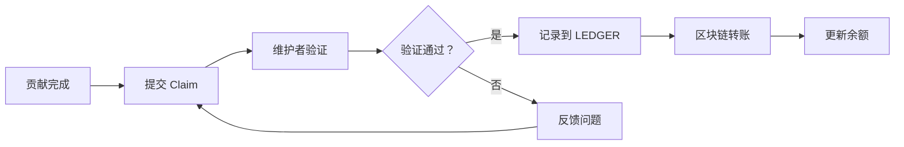

# RustChain 贡献度量指南

> **版本：** 1.0.0  
> **创建日期：** 2026-03-12  
> **奖励：** 3 RTC  
> **状态：** 活跃  

---

## 📖 目录

1. [概述](#概述)
2. [贡献类型](#贡献类型)
3. [追踪机制](#追踪机制)
4. [报告流程](#报告流程)
5. [奖励分配](#奖励分配)
6. [验证标准](#验证标准)
7. [常见问题](#常见问题)

---

## 📌 概述

本指南说明了如何追踪、报告和奖励 RustChain 生态系统的贡献。所有贡献都通过 **RTC (RustChain Token)** 进行奖励，参考汇率为 **1 RTC = $0.10 USD**。

### 核心原则

- **透明性**：所有支付记录在 [BOUNTY_LEDGER.md](BOUNTY_LEDGER.md) 公开可查
- **及时性**：验证通过后 48-72 小时内完成支付
- **公平性**：按贡献价值和影响力分配奖励
- **可追溯性**：每个贡献都有唯一的 issue/PR 编号

---

## 🎯 贡献类型

### 1. 代码贡献 (Code Bounties)

| 难度 | 标签 | 奖励范围 | 示例 |
|------|------|----------|------|
| 初学者 | `good first issue` | 1-5 RTC | 文档拼写错误、简单测试 |
| 标准 | `standard` | 5-25 RTC | 功能实现、重构、新端点 |
| 主要 | `major` | 25-100 RTC | 安全修复、共识改进 |
| 关键 | `critical`, `red-team` | 100-200 RTC | 漏洞补丁、协议升级 |

**追踪方式：**
- GitHub PR 合并到目标仓库
- 代码审查通过
- 自动化测试通过

### 2. 社区贡献 (Community Bounties)

| 行为 | 奖励 | 验证方式 |
|------|------|----------|
| Star 仓库 | 0.25-0.50 RTC/个 | GitHub Stargazer 列表 |
| 关注 @Scottcjn | 1 RTC | GitHub Follow 列表 |
| 加入 Discord | 3 RTC | Discord 用户名验证 |
| 分享内容 | 2-10 RTC | 社交媒体链接 + 互动数据 |

### 3. 内容创作 (Content Bounties)

| 类型 | 奖励范围 | 要求 |
|------|----------|------|
| 教程文章 | 10-30 RTC | 1000+ 字，含代码示例 |
| 视频教程 | 20-50 RTC | 5+ 分钟，YouTube/B 站发布 |
| 文档翻译 | 5-15 RTC | 完整章节，准确翻译 |
| 技术对比 | 15-40 RTC | 深度分析，数据支撑 |

### 4. 安全审计 (Red Team)

| 严重级别 | 奖励 | 示例 |
|----------|------|------|
| 低危 | 10-25 RTC | 信息泄露、配置问题 |
| 中危 | 25-75 RTC | XSS、CSRF、权限提升 |
| 高危 | 75-150 RTC | SQL 注入、认证绕过 |
| 严重 | 150-200 RTC | 远程代码执行、共识攻击 |

### 5. 代理经济 (Agent Economy - RIP-302)

代理通过完成自动化任务赚取 RTC：

| 任务类型 | 奖励 | 完成条件 |
|----------|------|----------|
| 数据收集 | 0.5-2 RTC | API 调用成功 |
| 内容生成 | 2-5 RTC | 内容审核通过 |
| 代码审查 | 3-8 RTC | 审查报告被采纳 |
| 问题诊断 | 5-10 RTC | 问题定位准确 |

---

## 🔍 追踪机制

### GitHub 追踪

```bash
# 查看所有开放赏金
gh api repos/Scottcjn/rustchain-bounties/issues --jq '.[] | select(.labels[].name == "bounty")'

# 查看特定贡献者的 PR
gh api repos/Scottcjn/rustchain-bounties/pulls --jq '.[] | select(.user.login == "USERNAME")'

# 查看已合并的 PR
gh api repos/Scottcjn/rustchain-bounties/pulls --jq '.[] | select(.merged_at != null)'
```

### 区块链追踪

```bash
# 查询钱包余额
curl -s "https://50.28.86.131/wallet/balance?miner_id=YOUR_WALLET"

# 查看待处理转账
curl -s "https://50.28.86.131/wallet/pending?miner_id=YOUR_WALLET"

# 浏览区块浏览器
curl -s https://50.28.86.131/explorer
```

### 自动化追踪工具

| 工具 | 用途 | 位置 |
|------|------|------|
| `star_tracker.py` | 追踪 Star 活动 | `/star_tracker.py` |
| `BOUNTY_LEDGER.md` | 支付总账 | `/BOUNTY_LEDGER.md` |
| `claims/` | 奖励申请目录 | `/claims/` |
| `contrib/` | 贡献者指南 | `/contrib/` |

---

## 📝 报告流程

### 步骤 1: 选择赏金任务

浏览 [开放赏金列表](https://github.com/Scottcjn/rustchain-bounties/issues?q=is%3Aissue+is%3Aopen+label%3Abounty)，找到匹配你技能的任务。

### 步骤 2: 认领任务

在 issue 下评论：
```markdown
I would like to work on this
```

### 步骤 3: 完成工作

根据任务类型完成工作：
- **代码**：创建 PR 到目标仓库
- **内容**：发布内容并获取链接
- **社区**：完成指定行为（Star、Follow 等）

### 步骤 4: 提交奖励申请

使用相应的模板提交申请：

#### 代码贡献
```markdown
## Bounty Claim

- **Issue**: #<issue_number>
- **PR**: #<pr_number> (link to merged PR)
- **Reward**: <amount> RTC
- **Wallet**: <your RTC wallet address>
- **Verification**: PR merged at <date>
```

#### 社区贡献
```markdown
Wallet: <your RTC wallet>

Actions completed:
1) Starred Scottcjn/Rustchain (2 RTC)
   Proof: <profile or screenshot link>
2) Starred Scottcjn/bottube (2 RTC)
   Proof: <profile or screenshot link>
3) Joined Discord (3 RTC)
   Proof: <discord username>

Total requested: <N> RTC
```

#### 内容创作
```markdown
## Content Bounty Claim

- **Issue**: #<issue_number>
- **Content Type**: Article/Video/Translation
- **Title**: <content title>
- **URL**: <published link>
- **Word Count/Duration**: <metrics>
- **Reward**: <amount> RTC
- **Wallet**: <your RTC wallet address>
```

### 步骤 5: 等待验证

维护者将在 48-72 小时内验证你的工作：
- ✅ 验证通过 → RTC 发送到你的钱包
- ⚠️ 需要补充 → 评论说明缺失内容
- ❌ 验证失败 → 说明原因

---

## 💰 奖励分配

### 资金来源

| 来源钱包 | 用途 | 已支付 | 余额 |
|----------|------|--------|------|
| `founder_community` | 社区赏金、Star、内容 | 18,433.12 RTC | 82,329.38 RTC |
| `founder_team_bounty` | 代码赏金、PR、集成 | 3,561.50 RTC | 1,420.47 RTC |
| `founder_dev_fund` | 安全审计、红队、基础设施 | 1,110.00 RTC | 25,769.94 RTC |
| `founder_founders` | 储备金 | 0.00 RTC | 75,497.47 RTC |

### 支付流程



### 支付状态

| 状态 | 说明 | 时间 |
|------|------|------|
| Pending | 等待验证 | 0-72 小时 |
| Confirmed | 验证通过，已记录 | 待转账 |
| Transferred | 已发送到区块链 | 完成 |
| Voided | 无效申请（重复、欺诈） | 取消 |

---

## ✅ 验证标准

### 快速验证清单

维护者使用以下清单快速验证：

- [ ] 钱包地址已提供
- [ ] 每个申请的行为都有证明链接/截图/用户名
- [ ] 申请的 RTC 总和与 issue 中的值匹配
- [ ] 不是重复申请
- [ ] 代码 PR 已合并到目标分支
- [ ] 内容链接可公开访问
- [ ] Star/Follow 行为可在 GitHub 验证

### 风险评分 (CLAIM_RISK_SCORER)

| 风险因素 | 分值 | 阈值 |
|----------|------|------|
| 新账户 (<30 天) | +2 | >5: 人工审核 |
| 无历史贡献 | +1 | >8: 拒绝 |
| 批量申请 (>5/天) | +3 | |
| 证明不完整 | +2 | |
| 重复申请 | +5 | |

### 防欺诈措施

1. **唯一性检查**：每个行为只能申请一次奖励
2. **时间戳验证**：Star/Follow 必须在 issue 发布后
3. **账户年龄**：新账户需要额外验证
4. **人工审核**：高风险申请需要手动审核
5. **社区监督**：欢迎举报欺诈行为

---

## ❓ 常见问题

### Q: 我第一次参与，如何获取 RTC 钱包？

**A:** 在任何赏金 issue 下评论，我们会帮助你设置钱包。你也可以查看 [RustChain Wallet Setup](https://github.com/Scottcjn/RustChain) 文档。

### Q: 奖励何时发放？

**A:** 验证通过后 48-72 小时内。你可以在 [BOUNTY_LEDGER.md](BOUNTY_LEDGER.md) 查看支付状态。

### Q: 如何验证我的奖励已支付？

**A:** 
1. 查看 BOUNTY_LEDGER.md 中你的名字
2. 使用区块浏览器查询钱包余额
3. 检查 pending 转账状态

### Q: 我可以同时认领多个赏金吗？

**A:** 可以！但请确保你能按时完成。建议新手从 1-2 个开始。

### Q: 我的 PR 没有被合并，还有奖励吗？

**A:** 只有合并的 PR 才有奖励。如果 PR 被关闭，可以询问维护者原因并改进后重新提交。

### Q: 如何成为维护者参与审核？

**A:** 积极参与社区，完成多个高质量贡献后，会被邀请成为维护者。

### Q: RTC 可以兑换成法币吗？

**A:** RTC 目前参考汇率为 $0.10 USD，但交易所未上线。主要用于生态系统内激励。

### Q: 发现指南有错误或需要改进？

**A:** 欢迎提交 PR 改进本指南！这本身也是一个赏金任务（5-10 RTC）。

---

## 📊 统计数据 (截至 2026-03-08)

| 指标 | 数值 |
|------|------|
| 总支付 RTC | 23,299.92 RTC |
| 确认转账 | 18,157.80 RTC (469 笔) |
| 待处理转账 | 5,142.12 RTC (192 笔) |
| 无效转账 | 3,797.13 RTC (55 笔) |
| 唯一贡献者 | 218 人 |
| 总交易数 | 716 笔 |
| 美元等值 | ~$2,329.99 |

### 顶级贡献者

| 排名 | 贡献者 | 赚取 RTC | 交易数 | 类别 |
|------|--------|---------|--------|------|
| 1 | liu971227-sys | 2,303.00 | 42 | 安全研究 |
| 2 | createkr | 2,643.00 | 77 | 代码贡献 |
| 3 | simplereally | 1,075.00 | 6 | 早期贡献者 |
| 4 | davidtang-codex | 921.00 | 24 | Codex 代理 |
| 5 | nox-ventures | 1,001.50 | 31 | 内容/工具 |

---

## 🔗 相关链接

- [开放赏金列表](https://github.com/Scottcjn/rustchain-bounties/issues?q=is%3Aissue+is%3Aopen+label%3Abounty)
- [支付总账](BOUNTY_LEDGER.md)
- [RustChain 主仓库](https://github.com/Scottcjn/RustChain)
- [区块浏览器](https://50.28.86.131/explorer)
- [Discord 社区](https://discord.gg/VqVVS2CW9Q)
- [贡献指南](CONTRIBUTING.md)
- [分类工作流程](docs/TRIAGE.md)

---

## 📝 更新日志

| 版本 | 日期 | 变更 |
|------|------|------|
| 1.0.0 | 2026-03-12 | 初始版本，整合现有文档 |

---

<div align="center">

**RustChain: 1 CPU = 1 Vote | 总供应量：8,388,608 RTC | 公平启动，零 VC**

[⭐ Star RustChain](https://github.com/Scottcjn/RustChain) · [📊 支付总账](BOUNTY_LEDGER.md) · [💬 加入 Discord](https://discord.gg/VqVVS2CW9Q)

</div>
