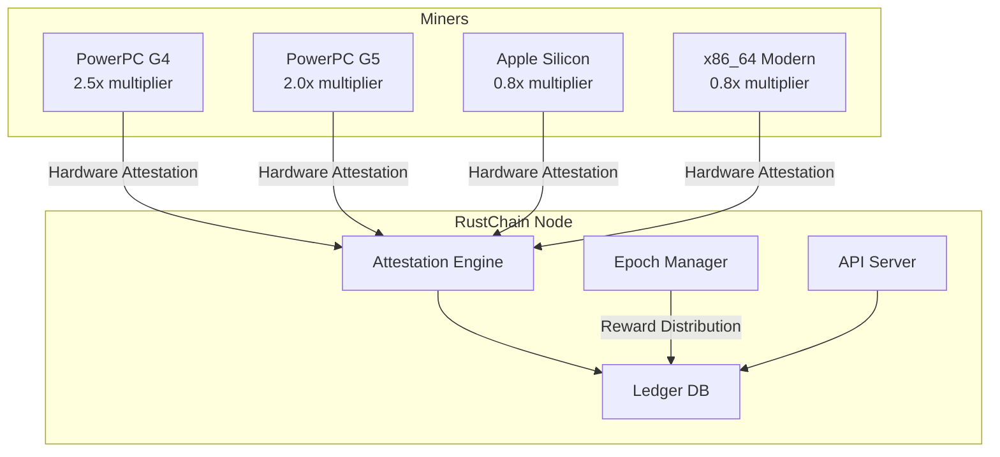

# RustChain Documentation

> **Comprehensive documentation for RustChain - the Proof-of-Attestation blockchain for real hardware.**

## Overview

RustChain is a next-generation blockchain that implements **RIP-200 Proof-of-Attestation** consensus. Unlike traditional Proof-of-Work or Proof-of-Stake systems, RustChain validates real hardware through a 6-point fingerprinting system, ensuring that every participant contributes genuine computational resources.

### Key Features

- **1 CPU = 1 Vote** — No GPU advantage, no ASIC dominance
- **Hardware Fingerprinting** — Real hardware only, VMs earn nothing
- **Antiquity Bonuses** — Vintage hardware (PowerPC G4/G5) earns up to 2.5x multiplier
- **Anti-emulation** — 6-point hardware fingerprint prevents spoofing
- **Epoch-based Rewards** — 1.5 RTC distributed per epoch to active miners
- **No Gas Fees** — RTC transfers are free on the RustChain ledger

### Network Stats

```
Chain ID:         rustchain-mainnet-v2
Version:          2.2.1-rip200
Total Supply:     ~200,000 RTC
Block Time:       600 seconds (10 minutes)
Blocks per Epoch: 144
```

## Quick Links

| Document | Description |
|----------|-------------|
| [Protocol](./protocol.md) | RIP-200 consensus, attestation flow, security |
| [API Reference](./api-reference.md) | All endpoints with curl examples |
| [Token Economics](./token-economics.md) | RTC supply, distribution, mining multipliers |
| [Architecture](./architecture.md) | Network architecture, nodes, miners |
| [Glossary](./glossary.md) | Terms and definitions |

## Network Resources

| Resource | URL |
|----------|-----|
| Node (Primary) | `https://50.28.86.131` |
| Health Check | `GET /health` |
| Active Miners | `GET /api/miners` |
| Network Stats | `GET /api/stats` |
| Current Epoch | `GET /epoch` |

## Getting Started

### Check Your Balance

```bash
curl -sk "https://50.28.86.131/wallet/balance?miner_id=YOUR_WALLET_ID"
```

### Start Mining

```bash
# Get the miner script
git clone https://github.com/Scottcjn/rustchain-bounties.git

# Run the miner
python3 rustchain_miner.py --wallet YOUR_WALLET_ID --node https://50.28.86.131
```

### Verify Network Health

```bash
curl -sk https://50.28.86.131/health
```

Response:
```json
{
  "ok": true,
  "version": "2.2.1-rip200",
  "uptime_s": 98511,
  "db_rw": true,
  "tip_age_slots": 0,
  "backup_age_hours": 0.19
}
```

## Architecture Diagram



## RIP Standards

RustChain implements several RIP (RustChain Improvement Proposals):

| RIP | Description |
|-----|-------------|
| RIP-0005 | Hardware fingerprinting |
| RIP-0008 | Antiquity multipliers |
| RIP-0009 | Epoch-based rewards |
| RIP-0142 | Signed transfers |
| RIP-0143 | Replay protection |
| RIP-0144 | Admin key validation |
| **RIP-200** | Proof-of-Attestation consensus |

## Security Features

- **No Mock Signatures** — All signatures are cryptographically verified
- **Mandatory Admin Key** — Administrative operations require key verification
- **Replay Protection** — Nonce-based transaction replay prevention
- **Validated JSON** — All API inputs are validated

## Contributing

RustChain operates a bounty board for contributors:

1. Browse open bounties on GitHub Issues (labeled "bounty")
2. Comment to claim with your RTC wallet ID
3. Submit work via Pull Request
4. Receive RTC payment upon approval

### Bounty Tiers

| Tier | RTC Range | Typical Scope |
|------|-----------|---------------|
| Micro | 1-10 RTC | Bug reports, docs fixes |
| Standard | 10-50 RTC | Feature implementation |
| Major | 50-200 RTC | Architecture work |
| Critical | 200-500 RTC | Security hardening |

## Links

- **Elyan Labs** — Builders of RustChain
- **BoTTube** — [bottube.ai](https://bottube.ai)
- **Moltbook** — [moltbook.com](https://moltbook.com)

---

*This documentation is maintained by the RustChain community. Contributions welcome!*
