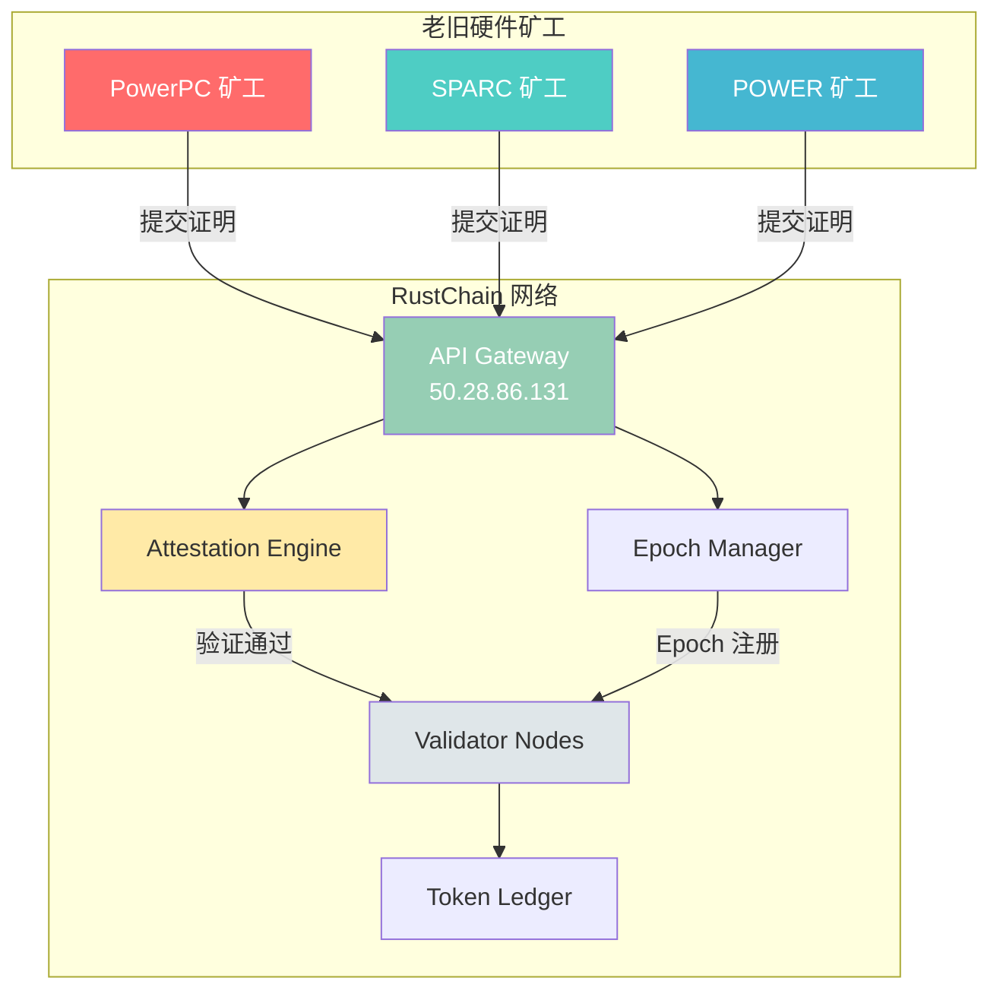
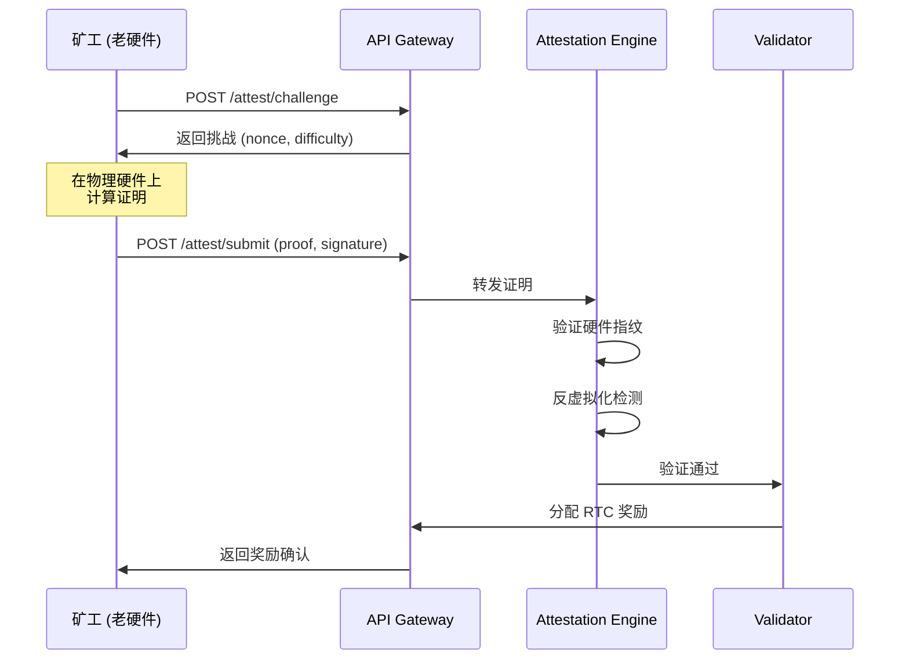
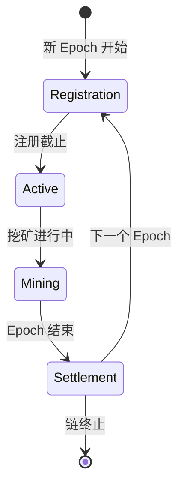
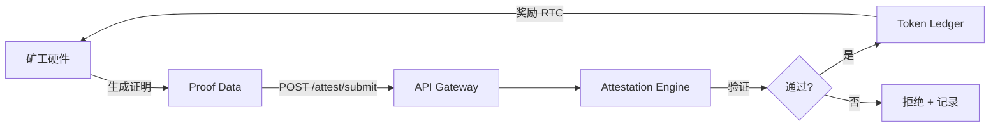

# RustChain 系统架构概述

> RustChain 是一条使用 Proof-of-Antiquity (PoA) 共识机制的区块链，让老旧硬件（PowerPC、SPARC、POWER 等）重新获得价值，参与网络挖矿。

---

## 目录

- [设计理念](#设计理念)
- [核心组件](#核心组件)
- [系统架构图](#系统架构图)
- [共识机制：Proof-of-Antiquity](#共识机制proof-of-antiquity)
- [挖矿流程](#挖矿流程)
- [Epoch 生命周期](#epoch-生命周期)
- [数据流](#数据流)
- [安全模型](#安全模型)
- [代币经济学](#代币经济学)

---

## 设计理念

传统 PoW 挖矿追求算力最大化，导致电子垃圾激增。RustChain 反其道而行：

- **赋予老旧硬件新生命** — 20 年前的机器也能挖矿
- **抗 ASIC** — 共识依赖硬件独特性，而非算力
- **绿色挖矿** — 功耗远低于传统 PoW

---

## 核心组件

| 组件 | 职责 |
|------|------|
| **Validator Node** | 验证交易和区块，维护链状态 |
| **Miner Client** | 运行在老旧硬件上，生成硬件证明 |
| **API Gateway** | 提供 RESTful API，连接矿工和验证节点 |
| **Attestation Engine** | 验证硬件证明的真实性 |
| **Epoch Manager** | 管理 Epoch 注册、轮换和奖励分配 |
| **Token Ledger** | RTC 代币余额和转账记录 |

---

## 系统架构图



---

## 共识机制：Proof-of-Antiquity

Proof-of-Antiquity (RIP-200) 的核心思想：**证明你拥有并正在使用真实的老旧硬件**。

### 三要素

1. **硬件指纹** — CPU 型号、指令集特征、时序特性
2. **挑战-响应** — 网络下发随机挑战，硬件必须实时计算
3. **反虚拟化检测** — 多维度验证物理硬件特征

### 与其他共识对比

| 特性 | PoW | PoS | PoA (RustChain) |
|------|-----|-----|-----------------|
| 资源消耗 | 高（电力） | 低 | 低 |
| 硬件门槛 | ASIC/高性能 GPU | 代币质押 | 老旧物理硬件 |
| 抗垄断 | 弱 | 中 | 强 |
| 环保性 | 差 | 好 | 好 |
| 电子垃圾利用 | 无 | 无 | **核心价值** |

---

## 挖矿流程



---

## Epoch 生命周期

RustChain 以 Epoch 为单位组织挖矿周期。



| 阶段 | 持续时间 | 说明 |
|------|----------|------|
| Registration | 前 24 小时 | 矿工注册并声明硬件 |
| Active | 6 天 | 挖矿、提交证明、累积奖励 |
| Settlement | 最后 1 小时 | 结算奖励，准备下一 Epoch |

---

## 数据流



---

## 安全模型

### 防攻击机制

- **反虚拟化** — 检测 VM 特征（CPUID、时序侧信道、I/O 行为）
- **硬件绑定** — 证明与特定硬件指纹关联，无法迁移
- **挑战时效** — 挑战 300 秒内有效，防止重放
- **频率限制** — 每矿工每 Epoch 有最大提交次数
- **质押惩罚** — 提交伪造证明将扣除质押的 RTC

### 网络安全

- 节点间通信使用 TLS（生产环境建议 CA 签名证书）
- API 支持 rate limiting
- 所有交易需要签名验证

---

## 代币经济学

| 参数 | 值 |
|------|-----|
| 代币符号 | RTC |
| 最大供应量 | 21,000,000 |
| 每个 Epoch 奖励 | 动态调整 |
| 减半周期 | 每 210,000 个区块 |
| 最小单位 | 1e-8 RTC |

---

## 技术栈

```
Rust (核心链逻辑)
├── tokio (异步运行时)
├── serde (序列化)
├── ring (密码学)
└── axum (HTTP 服务)

Python (SDK/工具)
├── requests (API 调用)
└── cryptography (签名)
```

---

*GitHub: [https://github.com/Scottcjn/Rustchain](https://github.com/Scottcjn/Rustchain)*
