# RustChain Network Architecture

## Overview

RustChain is a distributed ledger system designed around **Proof-of-Attestation** consensus. This document describes the network architecture, node types, and system components.

---

## High-Level Architecture

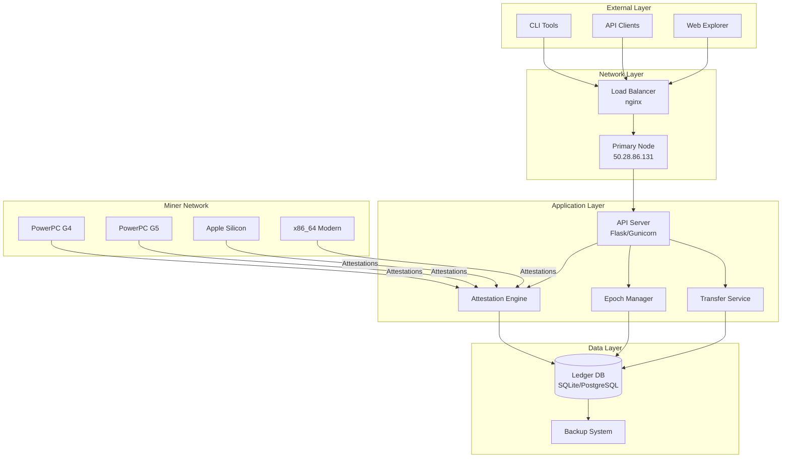

---

## Node Architecture

### Primary Node

The primary node (`50.28.86.131`) is the central coordination point for the network.

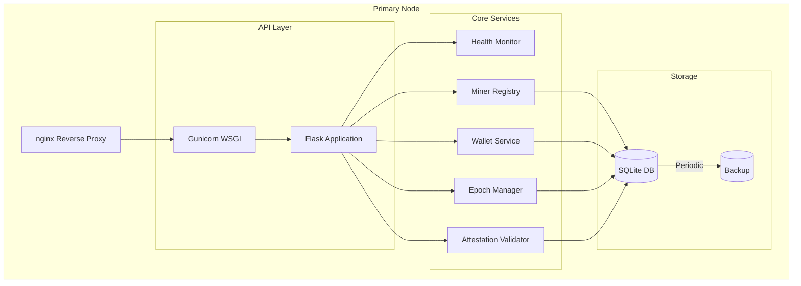

### Node Components

| Component | Technology | Purpose |
|-----------|------------|---------|
| Reverse Proxy | nginx 1.18.0 | SSL termination, load balancing |
| WSGI Server | Gunicorn | Python application serving |
| Application | Flask | API endpoints, business logic |
| Database | SQLite/PostgreSQL | Ledger storage |
| Backup | Custom | Periodic database snapshots |

---

## Miner Architecture

### Universal Miner Design

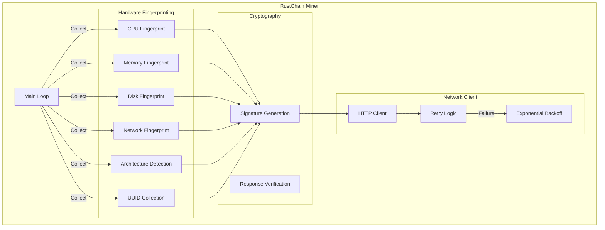

### Miner Configuration

```python
# Example miner configuration
config = {
    "wallet_id": "my-wallet-id",
    "node_url": "https://50.28.86.131",
    "attestation_interval": 600,  # seconds
    "retry_attempts": 3,
    "backoff_base": 2,  # exponential backoff base
}
```

### Supported Platforms

| Platform | Fingerprinting Method | Notes |
|----------|----------------------|-------|
| Linux x86_64 | `/proc/cpuinfo`, `lspci`, `dmidecode` | Full support |
| Linux ARM | `/proc/cpuinfo`, device tree | Full support |
| Linux PowerPC | `/proc/cpuinfo`, device tree | Full support |
| macOS Intel | `sysctl`, `system_profiler` | Full support |
| macOS Apple Silicon | `sysctl`, `system_profiler` | Full support |
| FreeBSD | `sysctl`, `pciconf` | Partial support |

---

## Data Architecture

### Ledger Schema

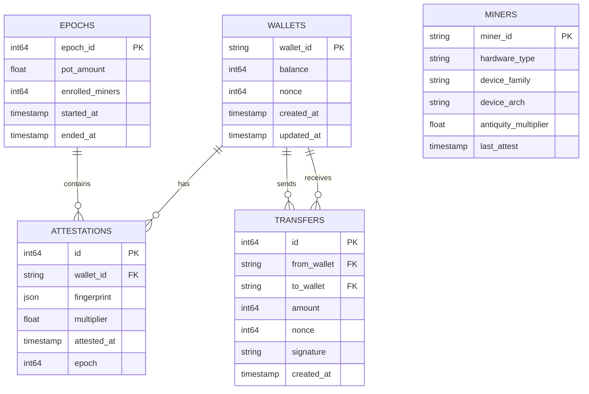

### Data Flow

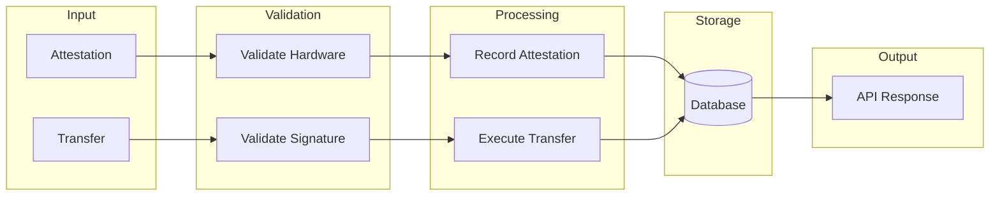

---

## Security Architecture

### Defense Layers

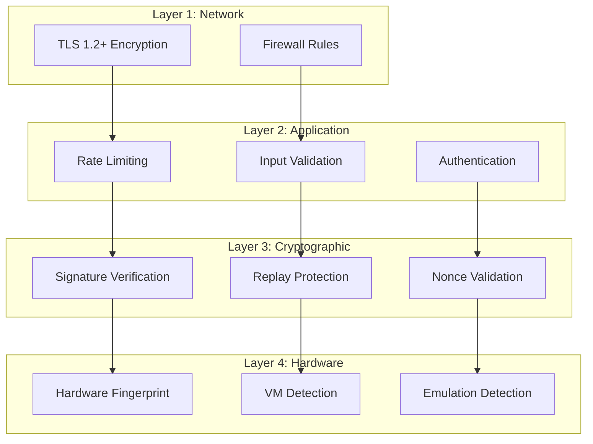

### Security Features (RIP-0144)

| Feature | Description | Implementation |
|---------|-------------|----------------|
| No Mock Signatures | All signatures verified | Ed25519 validation |
| Admin Key | Privileged ops require key | Header-based auth |
| Replay Protection | Nonce-based | Per-wallet counter |
| JSON Validation | Schema enforcement | Pydantic models |

---

## Network Topology

### Current Topology

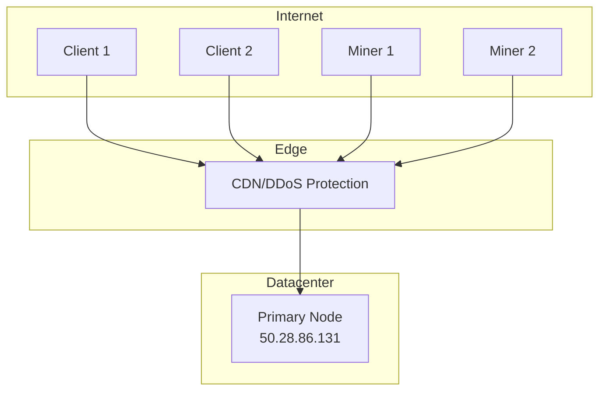

### Future Topology (Planned)

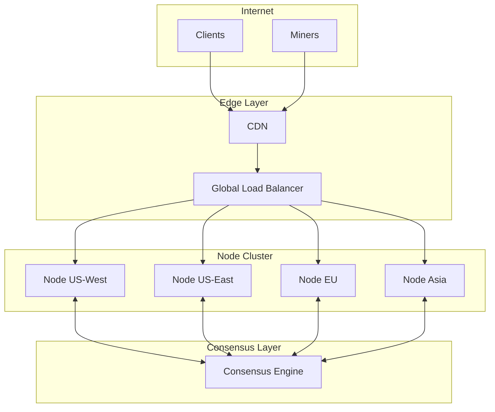

---

## Deployment Architecture

### Current Deployment

```yaml
# Deployment configuration
server:
  host: 50.28.86.131
  os: Ubuntu 20.04 LTS
  cpu: 2 vCPU
  memory: 4 GB
  storage: 120 GB SSD

services:
  nginx:
    version: 1.18.0
    ports: [80, 443]
    ssl: self-signed
    
  gunicorn:
    workers: 4
    timeout: 30
    
  flask:
    version: 2.x
    debug: false
    
  database:
    type: SQLite
    backup_interval: 1h
```

### Scaling Considerations

| Metric | Current | Target |
|--------|---------|--------|
| Requests/sec | 100 | 10,000 |
| Miners | 12,000 | 100,000 |
| Database size | <1 GB | 100 GB |
| Nodes | 1 | 10+ |

---

## Monitoring Architecture

### Health Monitoring

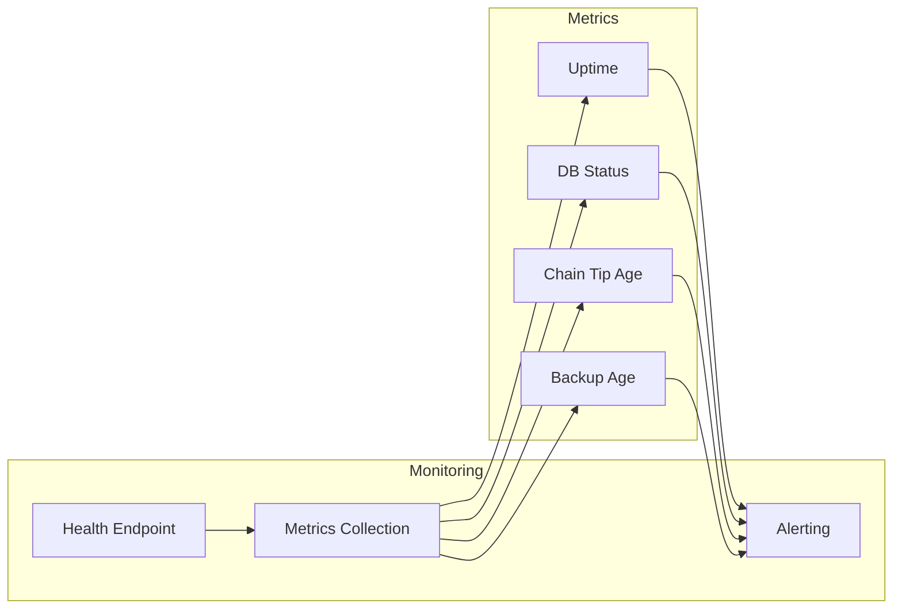

### Key Metrics

| Metric | Endpoint | Normal Value |
|--------|----------|--------------|
| `ok` | `/health` | `true` |
| `db_rw` | `/health` | `true` |
| `tip_age_slots` | `/health` | `< 5` |
| `backup_age_hours` | `/health` | `< 2` |
| `uptime_s` | `/health` | Increasing |

---

## Integration Points

### API Integration

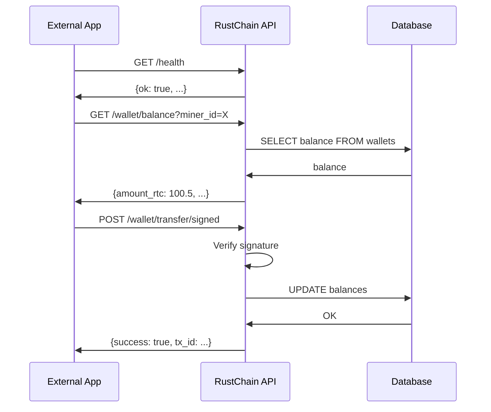

### Miner Integration

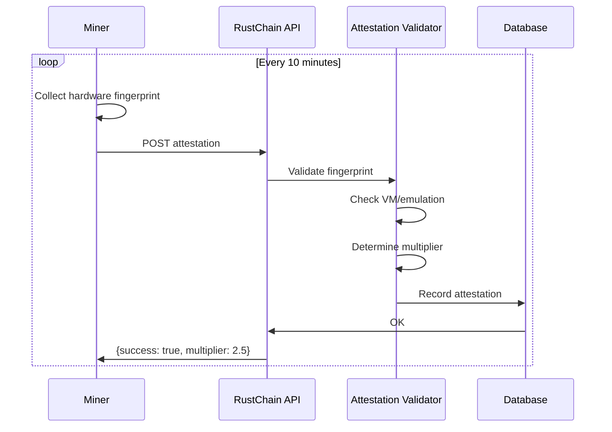

---

## Disaster Recovery

### Backup Strategy

| Component | Frequency | Retention | Location |
|-----------|-----------|-----------|----------|
| Database | Hourly | 7 days | Local + Remote |
| Configuration | Daily | 30 days | Git repository |
| Logs | Continuous | 30 days | Log aggregator |

### Recovery Procedures

1. **Database corruption**: Restore from latest backup
2. **Node failure**: Failover to standby (planned)
3. **Network partition**: Automatic reconnection
4. **DDoS attack**: CDN mitigation

---

## Future Architecture

### Planned Improvements

1. **Multi-node consensus** — Distributed validation
2. **Geographic distribution** — Global node deployment
3. **Horizontal scaling** — Database sharding
4. **WebSocket support** — Real-time updates
5. **IPFS integration** — Decentralized storage
