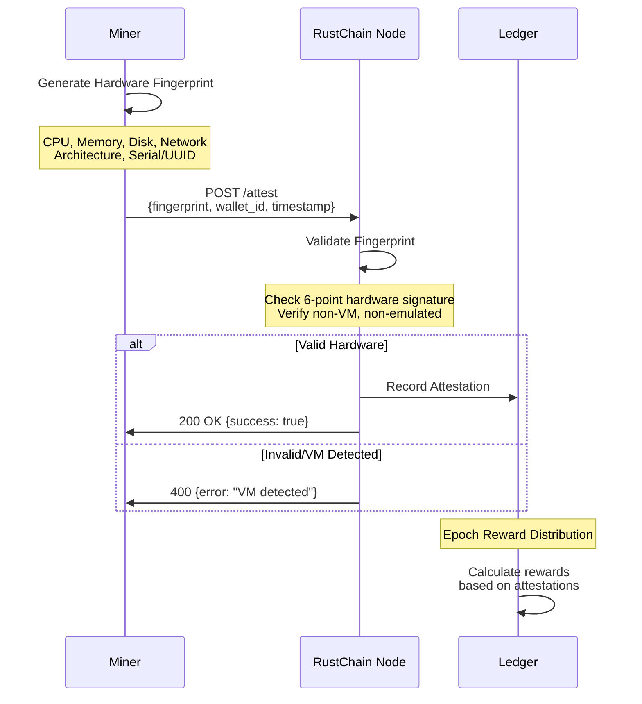
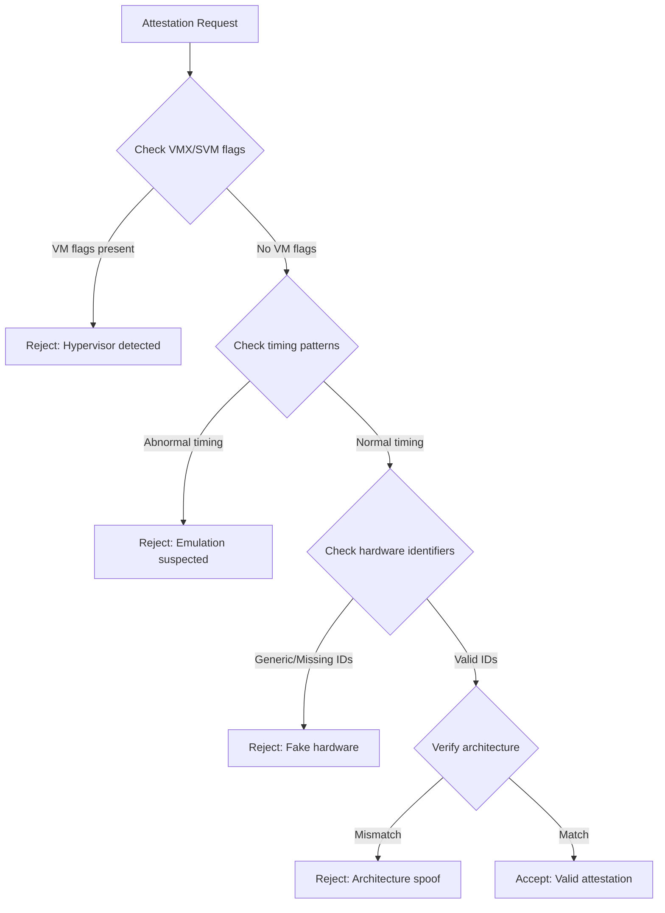
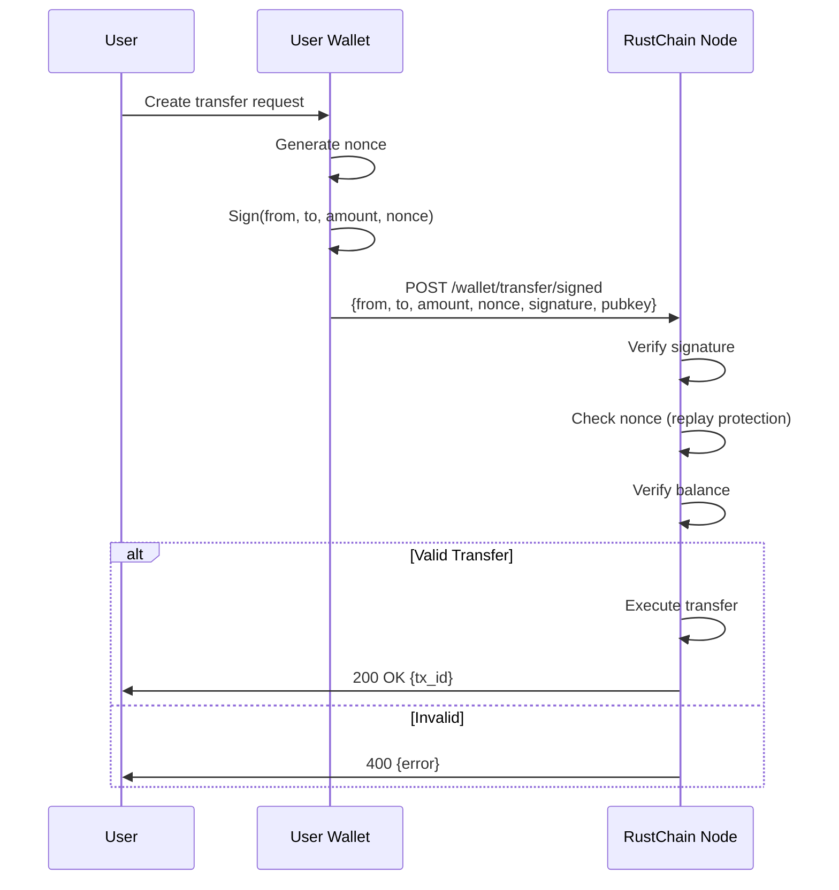
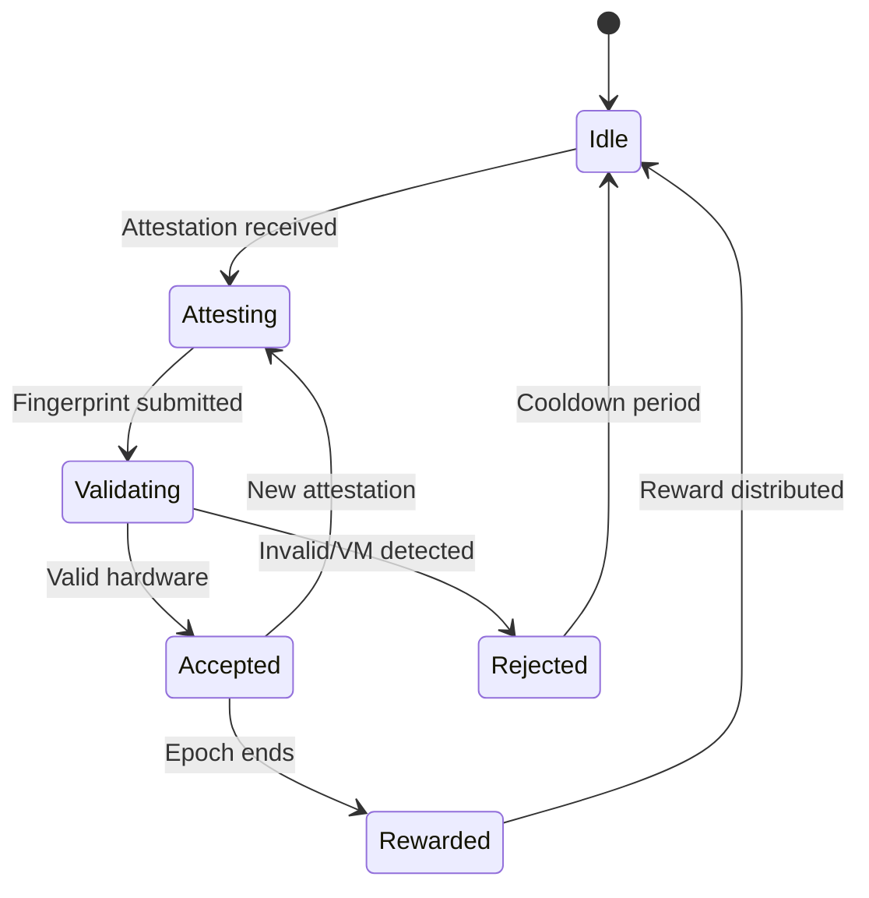

# RustChain Protocol Specification

## RIP-200: Proof-of-Attestation Consensus

### Overview

RIP-200 defines the Proof-of-Attestation (PoA) consensus mechanism that powers RustChain. Unlike traditional consensus mechanisms, PoA validates **real hardware** rather than computational puzzles or stake.

### Core Principles

1. **1 CPU = 1 Vote** — Every real CPU gets an equal voice
2. **Hardware Authenticity** — 6-point fingerprinting prevents emulation
3. **Antiquity Recognition** — Older hardware is valued and incentivized
4. **Energy Efficiency** — No wasteful computation, just attestation

## Attestation Flow



## Hardware Fingerprinting

RustChain uses a 6-point hardware fingerprint to verify real hardware:

### Fingerprint Components

| Point | Description | Detection Method |
|-------|-------------|------------------|
| 1. CPU | Processor model, cores, features | `cpuinfo`, `sysctl` |
| 2. Memory | Total RAM, speed, type | System APIs |
| 3. Disk | Storage type (SSD/HDD), serial | Block device info |
| 4. Network | MAC addresses, NIC types | Interface enumeration |
| 5. Architecture | CPU architecture (x86, ARM, PPC) | Binary analysis |
| 6. UUID | Unique hardware identifiers | DMI/SMBIOS data |

### Anti-Emulation Checks



## Epoch System

### Epoch Structure

- **Epoch Duration**: 144 blocks (~24 hours at 10-min blocks)
- **Epoch Pot**: 1.5 RTC per epoch
- **Distribution**: Proportional to valid attestations

### Reward Calculation

```
reward_per_miner = (epoch_pot × miner_attestations × multiplier) / 
                   Σ(all_attestations × multipliers)
```

### Multiplier System (RIP-0008)

| Architecture | Family | Multiplier | Rationale |
|-------------|--------|------------|-----------|
| PowerPC G4 | PowerPC | 2.5x | Vintage, rare, proven reliable |
| PowerPC G5 | PowerPC | 2.0x | High-end vintage |
| PowerPC G3 | PowerPC | 1.8x | Classic vintage |
| POWER8 | PowerPC | 2.0x | Enterprise PowerPC |
| Pentium 4 | x86 | 1.5x | Retro x86 |
| Retro x86 | x86 | 1.4x | Pre-Core architecture |
| Apple Silicon | ARM | 0.8x | Modern, efficient |
| Modern x86_64 | x86_64 | 0.8x | Modern commodity |

## Security Mechanisms

### Signature Verification

All transactions require cryptographic signatures:



### Replay Protection (RIP-0143)

- Each wallet maintains a **nonce** counter
- Transactions must include the next expected nonce
- Prevents replay attacks by rejecting duplicate nonces

### Admin Key Validation (RIP-0144)

- Administrative endpoints require a pre-shared admin key
- Key is verified server-side before processing
- User transfers use signed transactions instead

## Consensus Rules

### Block Validation

1. All attestations in block must be valid
2. Timestamps must be within acceptable range
3. Epoch transitions must follow rules
4. Reward distributions must be mathematically correct

### Fork Resolution

- Longest chain rule applies
- Attestation weight (multipliers) breaks ties
- Epoch boundaries are checkpoint-protected

## State Machine



## Protocol Messages

### Attestation Message

```json
{
  "wallet_id": "string",
  "timestamp": "ISO8601",
  "fingerprint": {
    "cpu": "...",
    "memory": "...",
    "disk": "...",
    "network": "...",
    "architecture": "...",
    "uuid": "..."
  },
  "signature": "hex-encoded"
}
```

### Transfer Message

```json
{
  "from_address": "string",
  "to_address": "string",
  "amount": 1000000,
  "nonce": 42,
  "signature": "hex-encoded",
  "public_key": "hex-encoded"
}
```

## Future RIPs

Planned improvements:

- **RIP-201**: Multi-node consensus
- **RIP-202**: Cross-chain bridges
- **RIP-203**: Smart contract support
- **RIP-204**: Governance voting

---

*This document describes RustChain protocol version 2.2.1-rip200*
