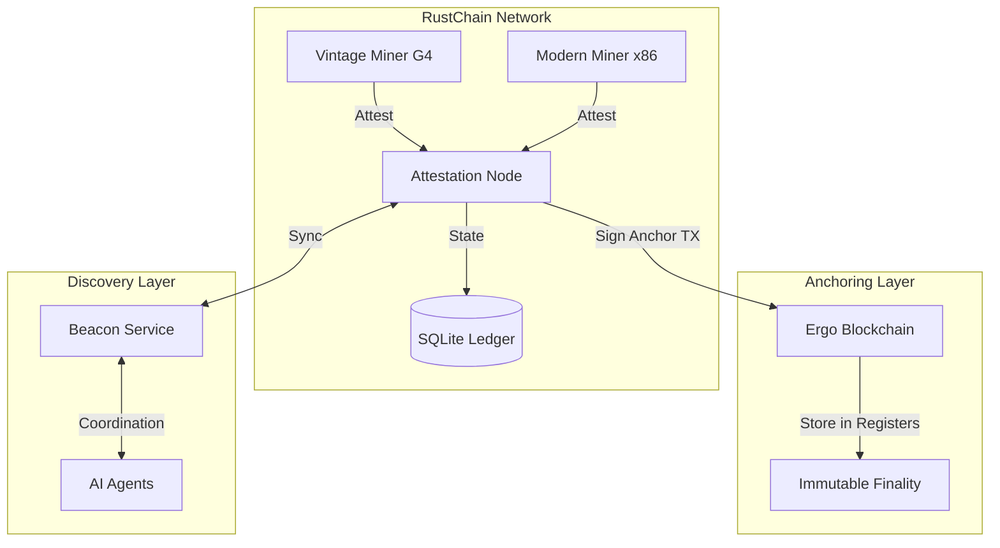

# Network Architecture & Ergo Anchoring

## Overview
RustChain is designed as a hybrid blockchain ecosystem. While the Proof-of-Antiquity (PoA) ledger operates independently for rapid attestations and reward distribution, it relies on the **Ergo Blockchain** as an external "Anchoring Layer" to provide immutable finality and security.

## Core Components

### 1. Attestation Nodes
The primary servers in the network. Their responsibilities include:
- **Challenge Issuance**: Managing nonces for miner requests.
- **Proof Validation**: Executing the 6+1 fingerprint checks on incoming payloads.
- **Ledger Management**: Recording successful attestations and epoch enrollments.
- **Reward Settlement**: Calculating RTC distributions based on antiquity multipliers.

### 2. Physical Miners
Real hardware devices running the RustChain client. They do not store the full chain but act as the "heartbeat" of the network by proving their presence every epoch.

### 3. Beacon Service
A coordination layer (Beacon 2.6 protocol) that allows miners and AI agents to:
- Broadcast heartbeats.
- Signal status (Mayday).
- Facilitate peer discovery in a distributed environment.

## Ergo Anchoring Mechanism
To prevent long-range attacks and ensure data integrity, RustChain periodically "anchors" its state to the Ergo blockchain.

### How Anchoring Works
1. **Commitment Generation**: Every 144 RustChain blocks (~24 hours), the node calculates a **Merkle Root** of the current state, including:
   - Block hashes.
   - Attestation records.
   - Ledger balances.
2. **Ergo Transaction**: The node creates a special transaction on the Ergo blockchain.
3. **Register Storage**: The RustChain commitments are stored directly in the Ergo transaction registers:
   - **R4**: RustChain block height.
   - **R5**: Commitment hash (Blake2b256).
   - **R6**: Timestamp.
4. **Finality**: Once the Ergo transaction reaches 6+ confirmations, the corresponding RustChain state is considered immutable.

### Verification of Proof
Any external auditor can verify a RustChain block by:
1. Fetching the anchor transaction ID from the RustChain node.
2. Querying the Ergo blockchain to retrieve the hash stored in Register R5.
3. Locally recalculating the RustChain state Merkle Root and comparing it to the anchored hash.

## Data Flow Diagram

---
*Back to [Overview](./OVERVIEW.md).*
