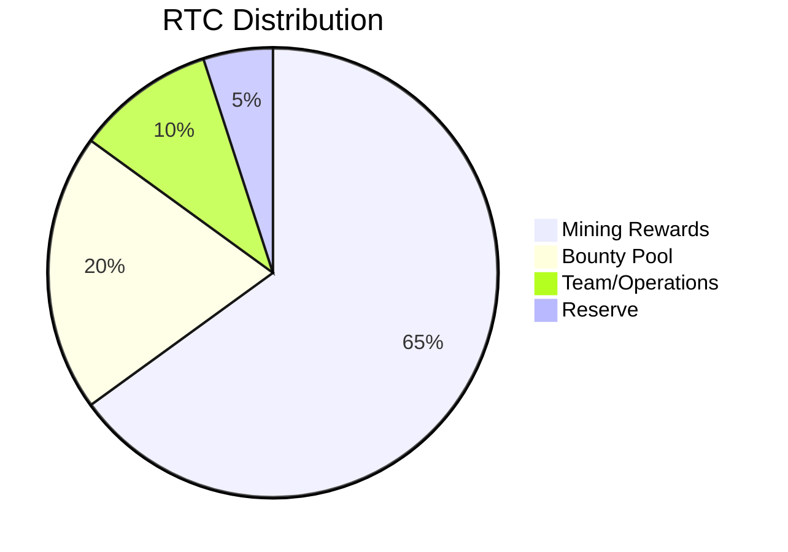
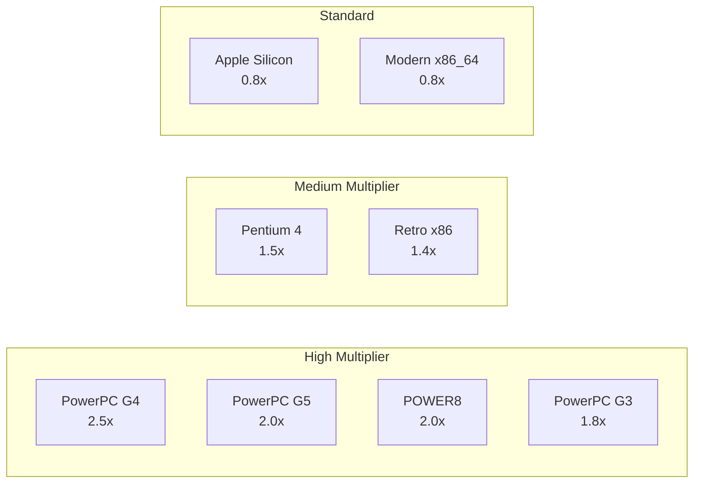
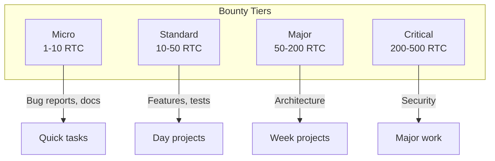

# RustChain Token Economics

## RTC Token Overview

**RTC (RustChain Token)** is the native currency of the RustChain network. It's designed to reward real hardware participation and enable frictionless value transfer.

### Key Properties

| Property | Value |
|----------|-------|
| Symbol | RTC |
| Decimals | 6 (1 RTC = 1,000,000 micro-RTC) |
| Max Supply | No hard cap (controlled emission) |
| Current Circulating | ~199,720 RTC |
| Transfer Fees | 0 (feeless) |
| Consensus | Proof-of-Attestation (RIP-200) |

---

## Token Distribution

### Current Distribution (as of Epoch 64)



### Emission Schedule

| Source | Rate | Notes |
|--------|------|-------|
| Epoch Rewards | 1.5 RTC/epoch | Distributed to active miners |
| Bounty Payouts | Variable | Based on task completion |
| Genesis | One-time | Initial distribution |

---

## Mining Economics

### Epoch Rewards

Each epoch (144 blocks, ~24 hours) distributes **1.5 RTC** to active miners.

```
Daily Emission: ~1.5 RTC
Weekly Emission: ~10.5 RTC
Monthly Emission: ~45 RTC
Annual Emission: ~547.5 RTC
```

### Reward Distribution Formula

```
miner_reward = (epoch_pot × attestation_count × multiplier) / 
               Σ(all_attestations × all_multipliers)
```

### Example Calculation

Given:
- Epoch pot: 1.5 RTC
- Miner A: 100 attestations, 2.5x multiplier (PowerPC G4)
- Miner B: 100 attestations, 0.8x multiplier (Modern x86)
- Miner C: 50 attestations, 2.0x multiplier (PowerPC G5)

Weighted shares:
- A: 100 × 2.5 = 250
- B: 100 × 0.8 = 80
- C: 50 × 2.0 = 100
- Total: 430

Rewards:
- A: 1.5 × (250/430) = **0.872 RTC**
- B: 1.5 × (80/430) = **0.279 RTC**
- C: 1.5 × (100/430) = **0.349 RTC**

---

## Antiquity Multipliers (RIP-0008)

RustChain rewards operators of vintage hardware with bonus multipliers:



### Full Multiplier Table

| Hardware | Family | Era | Multiplier | Monthly Est.* |
|----------|--------|-----|------------|---------------|
| PowerPC G4 | PowerPC | 1999-2005 | **2.5x** | ~0.35 RTC |
| PowerPC G5 | PowerPC | 2003-2006 | **2.0x** | ~0.28 RTC |
| POWER8 | PowerPC | 2014+ | **2.0x** | ~0.28 RTC |
| PowerPC G3 | PowerPC | 1997-2003 | **1.8x** | ~0.25 RTC |
| Pentium 4 | x86 | 2000-2008 | **1.5x** | ~0.21 RTC |
| Retro x86 | x86 | Pre-2006 | **1.4x** | ~0.19 RTC |
| Apple Silicon | ARM | 2020+ | **0.8x** | ~0.11 RTC |
| Modern x86_64 | x86_64 | 2006+ | **0.8x** | ~0.11 RTC |

*Estimates based on single miner with 100 attestations/epoch, typical network conditions.

### Design Rationale

1. **Sustainability** — Incentivizes repurposing old hardware vs. e-waste
2. **Decentralization** — Prevents datacenter dominance
3. **Uniqueness** — Creates differentiated mining opportunities
4. **Heritage** — Celebrates computing history

---

## Wallet Economics

### Wallet Creation

- **Cost**: Free
- **Requirements**: None (any string works as wallet ID on testnet)
- **Recommendation**: Use a unique, hard-to-guess identifier

### Transfer Economics

| Operation | Fee |
|-----------|-----|
| Receive RTC | 0 |
| Send RTC | 0 |
| Check Balance | 0 |

> RustChain transfers are completely **feeless**. This is sustainable due to the Proof-of-Attestation consensus which doesn't require expensive computation.

---

## Bounty Economics

### Bounty Tiers



### Typical Bounty Payouts

| Task Type | Example | Payout |
|-----------|---------|--------|
| Documentation | API docs, tutorials | 10-25 RTC |
| Bug Fix | Minor patch | 5-15 RTC |
| Feature | New endpoint | 25-50 RTC |
| Security | Vulnerability fix | 100-500 RTC |
| Integration | External service | 50-100 RTC |

---

## Economic Security

### Inflation Control

- Fixed epoch emission (1.5 RTC) creates predictable supply growth
- ~0.27% monthly inflation at current supply
- Decreasing percentage as supply grows

### Sybil Resistance

- Hardware fingerprinting prevents fake miners
- VM detection eliminates cheap cloning
- Physical hardware requirement adds real cost

### Attack Economics

| Attack | Cost | Reward | Viable? |
|--------|------|--------|---------|
| Hardware Spoofing | High (detection) | Low | ❌ No |
| Sybil (many VMs) | Low | 0 (detected) | ❌ No |
| 51% Attack | Very High (real HW) | Moderate | ❌ No |
| Bounty Fraud | Time | Bounty amount | ❌ No (review) |

---

## Value Proposition

### For Miners

1. **Passive Income** — Earn RTC by running hardware you already have
2. **Vintage Bonus** — Old hardware earns more, not less
3. **No Investment** — No special hardware needed to start
4. **Compounding** — Mined RTC can be reinvested in bounties

### For Developers

1. **Earn While Building** — Get paid in RTC for contributions
2. **Direct Payment** — No intermediaries or payment processors
3. **Instant Settlement** — RTC transfers are immediate
4. **Build Reputation** — On-chain history of contributions

### For the Network

1. **Real Hardware** — Every participant contributes genuine resources
2. **Sustainability** — Low energy consumption vs. PoW
3. **Decentralization** — Geographic and hardware diversity
4. **Community** — Aligned incentives between miners and developers

---

## Future Economics

### Planned Developments

| Feature | Impact on Economics |
|---------|-------------------|
| Cross-chain bridges | RTC liquidity on other chains |
| Staking | Alternative earning mechanism |
| Governance | RTC voting on protocol changes |
| Smart contracts | New utility for RTC |

### Long-term Vision

RustChain aims to create a sustainable economy where:
- Hardware longevity is rewarded
- Development is funded by the protocol
- Value accrues to active participants
- The network grows organically

---

## Glossary

| Term | Definition |
|------|------------|
| RTC | RustChain Token, native currency |
| Micro-RTC | 1/1,000,000 of an RTC |
| Epoch | 144-block period (~24 hours) |
| Epoch Pot | Total RTC distributed per epoch |
| Multiplier | Hardware-based bonus on rewards |
| Attestation | Proof of hardware participation |
